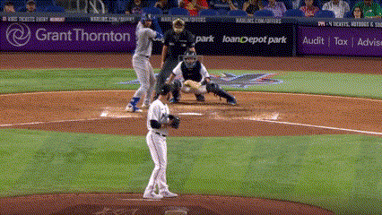

# Pitch Predictor Model

## Intro & Business Context
We are starting a sports analytics modeling company, and the first model we have created is an MLB pitch predictor, which will predict the type of pitch that will be thrown next during an at-bat. Our company believes in the growing influence of technology and data in sports decision-making, with AI at the forefront, and that emerging companies like ours will be able to compete in a market without dominant players in the private sector. We are beginning with a baseball model because of the tabular and static nature of the sport, with the goal of expanding our predictive-modeling capabilities to other sports as we continue to gain a foothold in the industry.
## Data Understanding
We scraped data from [baseballsavant](https://baseballsavant.mlb.com/), a website that collects MLB data from MLB.com's Statcast database, using [Pybaseball](https://github.com/basstraining/pitch_predictor/tree/main/notebooks/pybaseball), a python package that scrapes baseball data. This gave us a dataset of all the pitches thrown in the 2023 MLB season.

## Data Cleaning and Preproccesing
Much of our data cleaning was done in the [nathan_cleaning notebook](https://github.com/basstraining/pitch_predictor/blob/main/notebooks/nathan_cleaning.ipynb). Here, we cleaned our filtered data set of pitches from the pitchers in the top 15 percent of pitches thrown for the 2023 MLB season. We filtered out irrelevant columns, removed rows with null values, and used functions to create new columns to use as features in our model, such as large_score_dif to tell us whether the pitch occured while there was a large run differential at that point in the game, XBH to denote whether the batter had an extra-base hit against the pitcher in a previous at-bat during the game, and columns that gave us the zone, pitch type, and result of the three most recent pitches in the at-bat.

Once we had our [cleaned dataset](https://github.com/basstraining/pitch_predictor/blob/main/data/final_dataset_modeling.csv) with our new columns, we made the decision to convert our data to binary classes and this ended up making our dataset much more balanced for modeling, as our multiclass dataset with four different pitch types was quite imbalanced. This meant that our model would be predicting whether the pitch is a fastball (FB) or offspeed (OS).

We then set the target variable as pitch type and columns to include as features, initialized our OneHotEncoder, and performed a train-test split on our data. We also created a dummy model
the results of our final model to.

Our final preprocessing step was creating a ColumnTransformer to encode all categorical columns before creating a pipeline The end result is the categorical columns are one-hot encoded, and the other columns are left as-is.

## Modeling & Evaluation
First, created a pipeline for MLPClassifier, a neural network from sklearn. MLPClassifier (Multi-layer Perceptron classifier) is useful for classification tasks for data that contain nonlinear relationships. Then we used RandomizedSearchCV to cross validate (5 folds) and look for the best hyperparameters that we set in the param_distribution dictionary and get the best score.

We generated a classification_report to look at accuracy of our pitch predicition, as accuracy makes the most sense to evaluate our model on in the context of trying to accurately identify pitches. The accuracy in our classification report was 0.60, meaning that the model correctly predicts the pitch type 60% of the time across both classes ont the test data.

We generated a confusion matrix to display the results between our predictions.


Because we are unable to pull features from the neural network we will create another pipeline using a RandomForestClassifier and ran a GridSearchCV for hyperparamater tuning. This allowed us to see the most important features for our model:


## Conclusion & Next Steps
As previously mentioned accuracy is the metric we are evaluating on for this particular classification between FB and OS pitches. Our MLPClassifier will possibly perform better in a real world pitch sequence prediction model if deployed properly. With further tuning and tweaking, XGBoost could possible be another model to use for deployment. Analyzing a pitcher's tendencies and predicting the next pitch is quite a complex task. Further investigation and feature engineering could be explored to optimize these models for deployment in MLB games.

## Contributing 
If you would like to contribute to the project please fork the repository. You should activate your python env with `conda` or `venv` using  >= python3.8 and install the python package `pybaseball` with `pip`

Here is a link to the pybaseball package github repository: https://github.com/jldbc/pybaseball

#### On Linux/Mac/Windows
```
pip install pybaseball
```


## Repo Structure 
```
├── data
├── images
├── notebooks
│   ├── 
│   ├── 
├── .gitignore
├── LICENSE
├── README.md
├── binary_class_training_eval_final.ipynb
```
